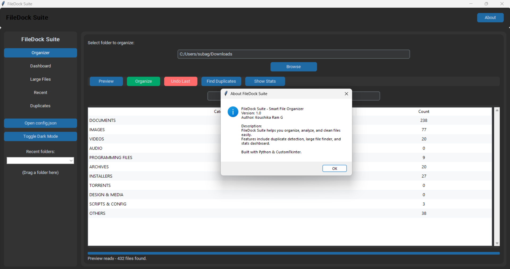
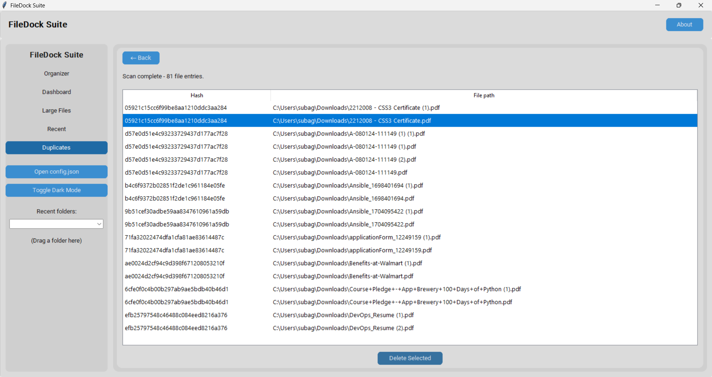
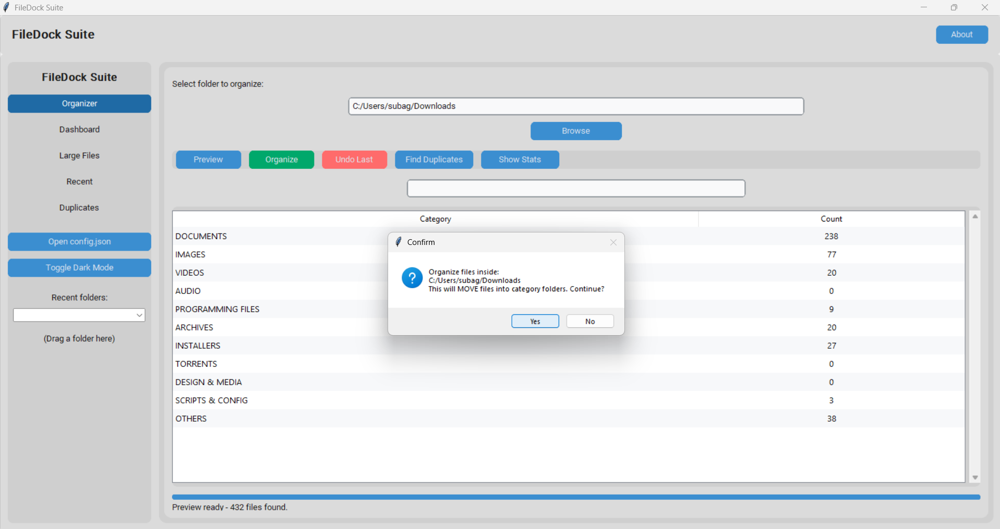
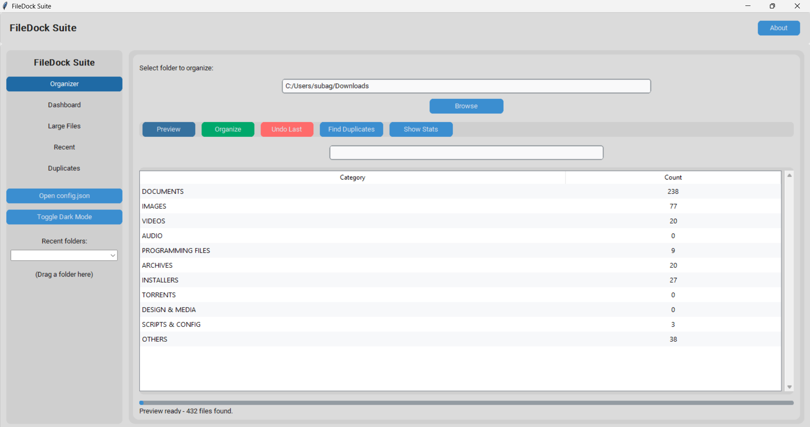
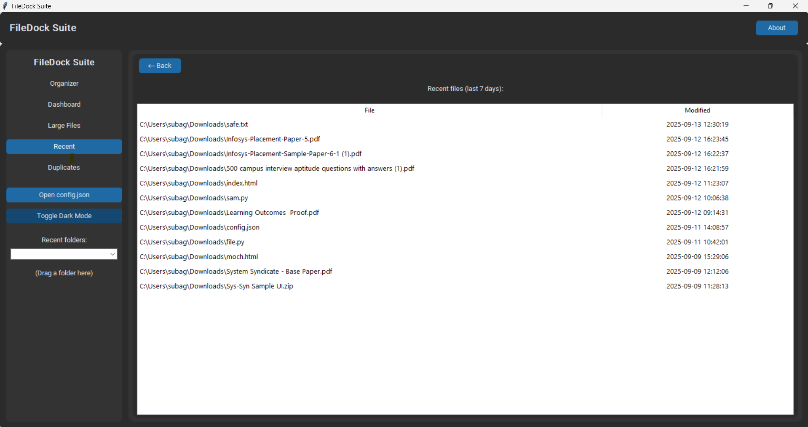
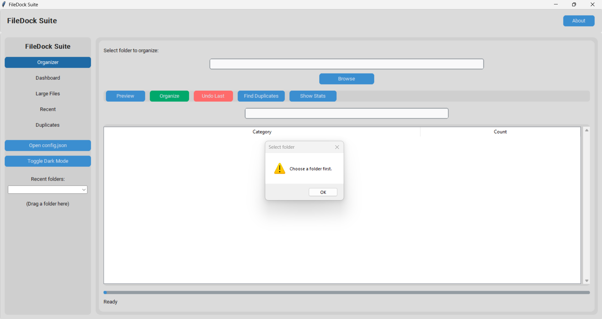
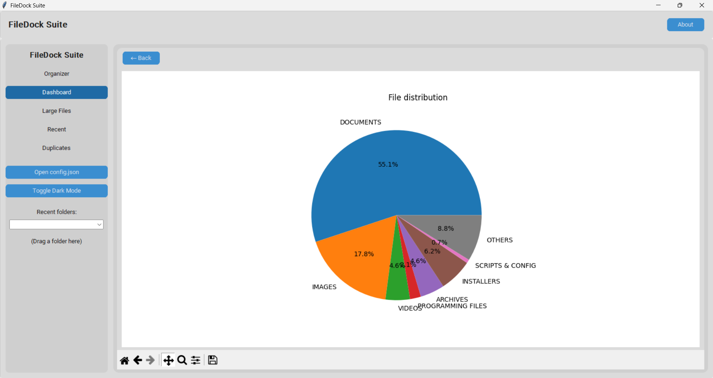

# 📂 FileDock Suite  

**FileDock Suite** is a smart file management tool built with **Python** and **CustomTkinter**.  
It helps users organize, analyze, and clean their files with an intuitive modern UI.  

---

## ✨ Features  

- 🔎 **Duplicate File Finder** – Detect and remove duplicate files.  
- 📊 **Statistics Dashboard** – View file distribution by type, size, and category.  
- 📁 **Large File Finder** – Quickly locate space-hogging files.  
- 🕒 **Recent Files Viewer** – Track recently modified files.  
- 🗂 **Category Organizer** – Organize files by type (documents, images, audio, video, etc.).  
- 🌙 **Dark/Light Mode** – Switch between modern dark and light themes.  
- ↩️ **Undo Support** – Safely revert file actions.  

---

## 🖥️ Tech Stack  

- **Python 3.11+**  
- **CustomTkinter** – Modern UI for Tkinter  
- **Matplotlib** – For file statistics and visualization  
- **OS / Shutil** – File operations  

---

## 📷 Screenshots  

### About  
  

### Duplicate Files  
  

### Organize  
  

### Preview  
  

### Recent Files  
  

### Select Folder  
  

### Statistics  
  

## 🚀 Installation  

1. Clone this repository:  

   git clone https://github.com/KoushikaRam/FileDock-Suite.git
   cd FileDock-Suite

2. Install dependencies:

pip install -r requirements.txt

3. Run the application:

python FileDock-Suite.py

📦 Requirements

Create a requirements.txt file with:

customtkinter
matplotlib

🧑‍💻 Author

KoushikaRam
Smart File Management Enthusiast 🚀

📜 License

This project is licensed under the MIT License – free to use and modify.